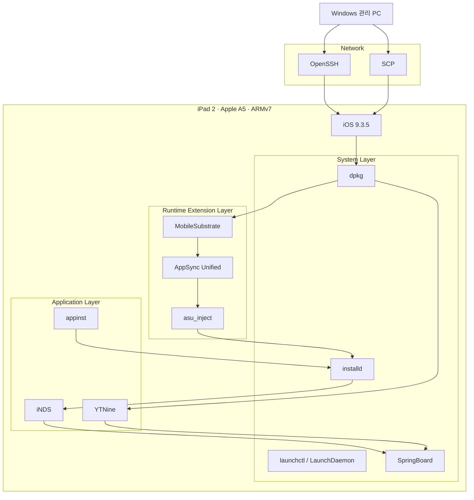
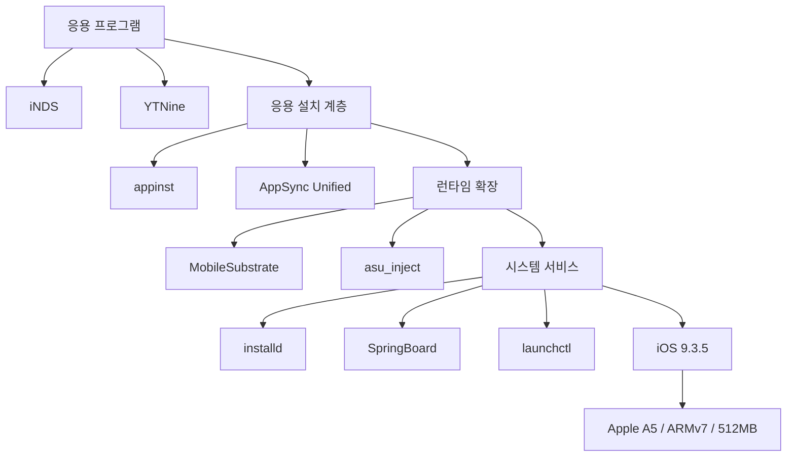
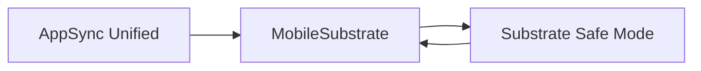
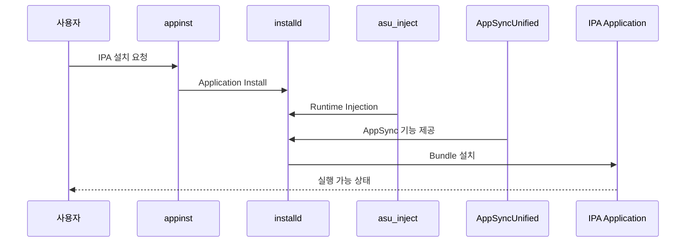
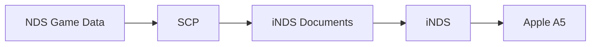
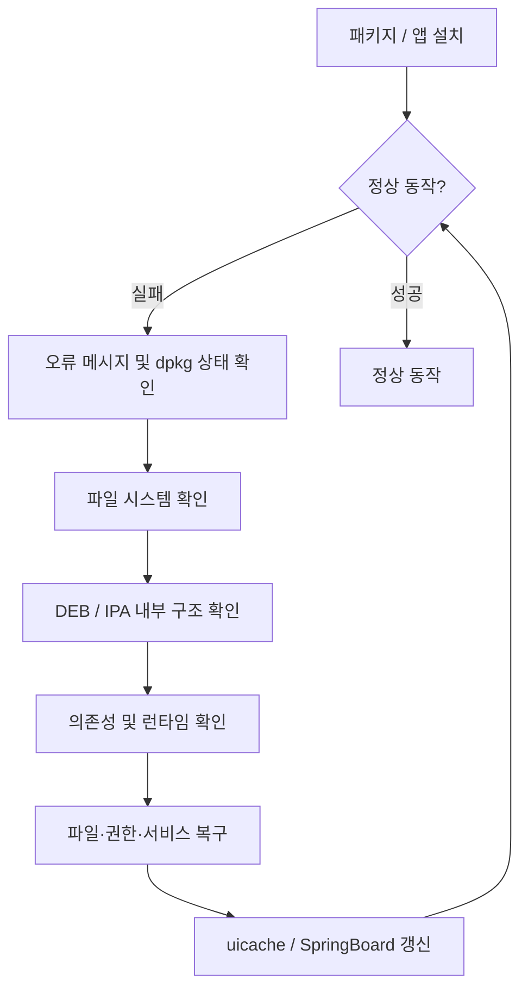
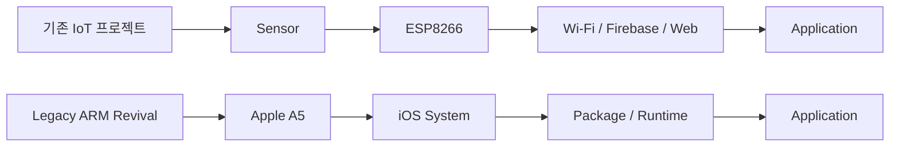

# iPad 2 Legacy ARM System Revival

> **지원 종료된 Apple A5 기반 ARMv7 장치를 분석하고, SSH·패키지 복구·런타임 주입을 통해 실사용 가능한 레거시 시스템으로 재구성한 프로젝트**

<p align="center">
  <strong>Apple A5 · ARMv7 · 32-bit · iOS 9.3.5 · OpenSSH · dpkg · MobileSubstrate</strong>
</p>

---

## 프로젝트 개요

본 프로젝트는 **iPad 2 (Wi-Fi, 32GB)** 를 대상으로, 공식 지원이 종료된 iOS 9.3.5 환경에서 시스템 접근 권한을 확보하고 필요한 런타임과 패키지를 직접 복구하여 다시 활용하는 것을 목표로 한다.

단순한 탈옥 기록이 아니라, **제약된 레거시 ARM 환경에서 소프트웨어 스택을 분석하고 문제를 단계적으로 해결한 시스템 재활용 프로젝트**로 정리하였다.

| 구분 | 내용 |
|---|---|
| 장치 | Apple iPad 2 |
| 프로세서 | Apple A5 |
| 아키텍처 | ARMv7 / 32-bit |
| 메모리 | 512MB |
| 저장공간 | 32GB |
| 운영체제 | iOS 9.3.5 |
| 시스템 접근 | OpenSSH |
| 패키지 관리 | dpkg |
| 런타임 확장 | MobileSubstrate |
| IPA 설치 | AppSync Unified + appinst |
| 주요 결과 | iNDS, YTNine 정상 구동 |

---

## 프로젝트 목표

- 지원 종료된 ARMv7 장치의 시스템 구조 분석
- SSH 기반 원격 관리 환경 구축
- 최신 PC와 구형 SSH 서버 간 호환성 문제 해결
- `dpkg` 패키지 의존성 직접 복구
- MobileSubstrate 기반 런타임 확장
- AppSync Unified의 `installd` 주입 문제 해결
- IPA / DEB 수동 설치 경로 구성
- 잘못 배치된 Application Bundle 직접 복구
- Nintendo DS 에뮬레이션 및 YouTube 클라이언트 구동

---

# 시스템 아키텍처



---

# 소프트웨어 계층



---

# 1. SSH 원격 관리 환경 구축

구형 iOS의 SSH 서버는 `ssh-rsa`, `ssh-dss` 방식의 호스트 키를 제공하지만 최신 OpenSSH는 이를 기본 비활성화한다.

발생한 오류:

```text
Unable to negotiate with 192.168.0.17 port 22:
no matching host key type found.
Their offer: ssh-rsa,ssh-dss
```

해결:

```bash
ssh -oHostKeyAlgorithms=ssh-rsa root@192.168.0.17
```

파일 전송:

```bash
scp -oHostKeyAlgorithms=ssh-rsa package.deb root@192.168.0.17:/var/mobile/
```

이 과정에서는 최신 개발환경과 레거시 장치 간 **암호화 알고리즘 호환성 문제**를 직접 확인하고 해결하였다.

---

# 2. 패키지 의존성 복구

AppSync Unified 설치 과정에서 `MobileSubstrate`와 `Substrate Safe Mode` 사이에 순환 의존성이 발생하였다.



강제 구성 옵션을 이용해 패키지 상태를 복구하였다.

```bash
dpkg --force-depends --configure mobilesubstrate
dpkg --configure com.saurik.substrate.safemode
dpkg --configure ai.akemi.appsyncunified
dpkg --configure -a
```

정상 여부 확인:

```bash
dpkg -l | grep -E 'mobilesubstrate|substrate.safemode|appsync'
```

---

# 3. AppSync Unified 런타임 주입 복구

iOS 9.3.x 32비트 환경에서는 AppSync 설치가 완료되어도 `installd`에 라이브러리가 정상 주입되지 않는 문제가 발생하였다.

필요 구성요소:

```text
/usr/bin/asu_inject

/Library/LaunchDaemons/
└── ai.akemi.asu_inject.plist

/Library/MobileSubstrate/DynamicLibraries/
├── AppSyncUnified-FrontBoard.dylib
├── AppSyncUnified-FrontBoard.plist
├── AppSyncUnified-installd.dylib
└── AppSyncUnified-installd.plist
```

DEB 내부 확인:

```bash
dpkg-deb -c /var/mobile/appsync.deb | grep -E 'asu_inject|AppSyncUnified'
```

패키지 직접 추출:

```bash
mkdir -p /var/mobile/asufix
dpkg-deb -x /var/mobile/appsync.deb /var/mobile/asufix
```

필요 파일 복구:

```bash
cp /var/mobile/asufix/usr/bin/asu_inject /usr/bin/asu_inject

cp /var/mobile/asufix/Library/LaunchDaemons/ai.akemi.asu_inject.plist \
/Library/LaunchDaemons/

mkdir -p /Library/MobileSubstrate/DynamicLibraries

cp /var/mobile/asufix/Library/MobileSubstrate/DynamicLibraries/AppSyncUnified-* \
/Library/MobileSubstrate/DynamicLibraries/
```

권한 설정:

```bash
chown root:wheel /usr/bin/asu_inject
chmod 755 /usr/bin/asu_inject

chown root:wheel /Library/LaunchDaemons/ai.akemi.asu_inject.plist
chmod 644 /Library/LaunchDaemons/ai.akemi.asu_inject.plist
```

---

## AppSync 동작 흐름



---

# 4. iNDS 설치

```bash
appinst /var/mobile/iNDS.ipa
```

확인된 Bundle Identifier:

```text
net.nerd.iNDS
```

설치 후:

```bash
uicache
killall SpringBoard
```

### 데이터 흐름



---

# 5. YTNine 기반 YouTube 기능 복구

| 항목 | 내용 |
|---|---|
| Package | `com.himais0giiiin.ytnine` |
| Version | `1.1.3-1` |
| Architecture | `iphoneos-arm` |
| 역할 | iOS 9용 YouTube Client |

설치:

```bash
dpkg -i /var/mobile/ytnine.deb
```

설치 상태:

```text
ii  com.himais0giiiin.ytnine  1.1.3-1
```

패키지는 정상 설치 상태였지만 홈 화면에 표시되지 않았다.

```bash
ls /Applications/YTNine.app
```

결과:

```text
No such file or directory
```

DEB 내부 확인:

```bash
dpkg-deb -c /var/mobile/ytnine.deb | grep YTNine
```

직접 추출 및 복구:

```bash
mkdir -p /var/mobile/ytnine_extract

dpkg-deb -x /var/mobile/ytnine.deb /var/mobile/ytnine_extract

cp -R /var/mobile/ytnine_extract/Applications/YTNine.app /Applications/
```

권한 수정:

```bash
chown -R root:wheel /Applications/YTNine.app
chmod 755 /Applications/YTNine.app
chmod 755 /Applications/YTNine.app/YTNine
```

SpringBoard 캐시 재생성:

```bash
uicache
killall SpringBoard
```

---

# 문제 해결 흐름



---

# 주요 트러블슈팅

| 문제 | 원인 | 해결 |
|---|---|---|
| SSH 접속 불가 | 최신 OpenSSH에서 `ssh-rsa` 비활성화 | HostKeyAlgorithms 명시 |
| `apt-get` 없음 | 최소 탈옥 환경 / APT 미구성 | `dpkg` 중심 처리 |
| AppSync 설정 실패 | MobileSubstrate 의존성 | Substrate 구성 |
| Substrate 순환 의존성 | Safe Mode ↔ MobileSubstrate | `--force-depends` 활용 |
| IPA 설치 실패 | AppSync가 `installd`에 미주입 | `asu_inject` 복구 |
| appinst 의존성 불일치 | 과거 AppSync 패키지 ID 사용 | 실행 파일 직접 추출 |
| YTNine 아이콘 미표시 | Application Bundle 미배치 | DEB 직접 추출 후 복사 |
| 설치 후 앱 미표시 | SpringBoard 캐시 미갱신 | `uicache` 실행 |

---

# 최종 시스템

```text
┌────────────────────────────────────────────┐
│                 iPad 2                     │
│      Apple A5 · ARMv7 · 32-bit             │
│              512MB RAM                     │
├────────────────────────────────────────────┤
│               iOS 9.3.5                    │
├────────────────────────────────────────────┤
│ OpenSSH │ SCP │ dpkg │ launchctl           │
├────────────────────────────────────────────┤
│ MobileSubstrate │ AppSync │ asu_inject     │
├────────────────────────────────────────────┤
│                 appinst                    │
├────────────────────────────────────────────┤
│       iNDS                  YTNine          │
│   Nintendo DS              YouTube         │
└────────────────────────────────────────────┘
```

---

# 임베디드 시스템 관점

이 프로젝트에서 중요했던 것은 단순히 오래된 태블릿에 애플리케이션을 설치하는 것이 아니다.

지원이 종료된 ARM 기반 장치에서 **하드웨어 제약 → 운영체제 → 시스템 서비스 → 패키지 관리 → 런타임 → 응용 프로그램**으로 이어지는 계층을 직접 확인하고, 각 단계에서 발생한 문제를 로그와 파일 시스템을 통해 분석하였다.

```text
Hardware
   ↓
Operating System
   ↓
System Services
   ↓
Package Management
   ↓
Runtime Extension
   ↓
Application Installation
   ↓
Application
```

### 경험한 기술 요소

- ARMv7 32비트 레거시 환경
- SSH / SCP 원격 시스템 관리
- UNIX 파일 권한
- Debian Package 구조
- `dpkg` 패키지 관리
- LaunchDaemon / `launchctl`
- MobileSubstrate
- Dynamic Library Injection
- `installd`
- Application Bundle
- SpringBoard
- 단계적 트러블슈팅

---

# 기존 임베디드 프로젝트와의 연계

기존 ESP8266 프로젝트에서는 주로 다음 구조를 다뤘다.

```text
Sensor
   ↓
ESP8266
   ↓
Wi-Fi
   ↓
Firebase / Web
   ↓
Application
```

이번 프로젝트에서는 방향을 바꾸어 다음과 같은 시스템 내부 계층을 다뤘다.

```text
Apple A5
   ↓
iOS
   ↓
System Service
   ↓
Package / Runtime
   ↓
Application
```



이를 통해 장치 제어 중심의 임베디드 경험에서 **운영체제와 런타임을 포함한 시스템 레벨 문제 해결 경험**으로 확장하였다.

---

# 프로젝트 결과

| 항목 | 결과 |
|---|---|
| SSH 원격 접속 | ✅ |
| SCP 파일 전송 | ✅ |
| DEB 수동 설치 | ✅ |
| 패키지 의존성 복구 | ✅ |
| MobileSubstrate 구성 | ✅ |
| AppSync 런타임 주입 | ✅ |
| IPA 수동 설치 | ✅ |
| iNDS 실행 | ✅ |
| Nintendo DS 실행 | ✅ |
| YTNine 설치 | ✅ |
| YouTube 재생 | ✅ |

---

# Repository Structure

```text
.
├── README.md
├── docs
│   ├── images
│   │   ├── ipad2-device.jpg
│   │   ├── ssh-session.png
│   │   ├── inds-running.jpg
│   │   └── ytnine-running.jpg
│   └── logs
│       ├── appsync-install.txt
│       ├── inds-install.txt
│       └── ytnine-install.txt
└── scripts
    └── README.md
```

> 실제 작업 화면을 추가할 경우 `docs/images`에 SSH 로그, iNDS 실행 화면, YTNine 실행 화면을 배치하면 프로젝트 신뢰도가 높아진다.

---

# Project Status

```text
Remote Access             [OK]
Package Recovery          [OK]
Runtime Injection         [OK]
Manual IPA Installation  [OK]
Nintendo DS              [OK]
YouTube                   [OK]
```

**Legacy ARM Device Revival — Completed**
